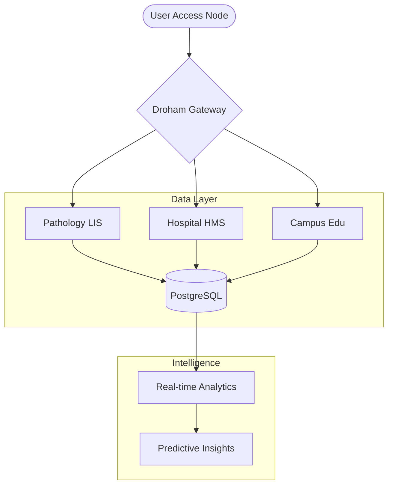

# Droham — Global Enterprise Intelligence Platform

[](https://github.com/SudipBera083/Droham)
[](LICENSE)
[](https://www.python.org/downloads/)
[](https://docs.djangoproject.com/en/5.1/)
[](#)

Droham is the industry-leading, next-generation ERP (Enterprise Resource Planning) ecosystem engineered for the complexities of 2030. We provide mission-critical infrastructure for Hospitals, Diagnostic Centers, and Educational Institutions, unifying disparate operations into a single, high-performance intelligence layer.

[**Request a Demo**](https://droham.com/demo) | [**Documentation**](https://docs.droham.com) | [**Support**](mailto:support@droham.com)

---

## 🏛️ Ecosystem Architecture

Droham is built on a modular "Nexus" architecture that scales horizontally across different enterprise verticals.



---

## 🚀 Core Enterprise Modules

### 🔬 Pathology LIS (Life Sciences)
Accelerate diagnostic workflows with our state-of-the-art Laboratory Information System.
- **Automated Sample Tracking**: End-to-end chain of custody with IoT integration.
- **Machine Interfacing**: Direct integration with over 100+ diagnostic analyzers.
- **Dynamic Report Engine**: High-fidelity, verifiable digital reports with 40% faster turnaround.

### 🏥 Hospital HMS (Medical Operations)
A comprehensive Management System that transforms patient care from admission to discharge.
- **Patient Lifecycle Management**: Seamless OPD/IPD transition and electronic health records.
- **Resource Orchestration**: Optimized operating theater and bed management.
- **Financial Integrity**: Real-time billing, insurance processing, and revenue cycle management.

### 🏫 Campus Edu (Institutional Governance)
Digitalizing the future of education with a unified campus management solution.
- **Campus-wide Integration**: One platform for student lifecycle, faculty management, and alumni records.
- **Intelligent Scheduling**: Automated timetabling and attendance tracking.
- **Scholarship & Fee Management**: Secure, multi-channel payment processing.

---

## 🛠️ Technical Stack & Security

Droham is engineered for maximum reliability and secure-by-design principles.

| Component | Technology | Role |
| :--- | :--- | :--- |
| **Backend** | Django 5.1.4 | High-performance application logic |
| **Language** | Python 3.8+ | Scalable and maintainable codebase |
| **Database** | PostgreSQL | Enterprise-grade data integrity |
| **Frontend** | Modern JS / CSS3 | Zero-friction, responsive interface |
| **Security** | AES-256 / SSL | End-to-end data encryption |

---

## ⚡ Quick Start (On-Premise Deployment)

### Prerequisites

- **Python**: 3.8.0 or higher
- **PostgreSQL**: 14.0 or higher (Production Recommended)
- **Node.js**: 18.0+ (For frontend assets)

### Installation

1.  **Clone the Enterprise Repository**
    ```bash
    git clone https://github.com/SudipBera083/Droham.git
    cd Droham
    git checkout django-fullstack
    ```

2.  **Environment Setup**
    ```bash
    python -m venv venv
    # Linux/MacOS
    source venv/bin/activate 
    # Windows
    venv\Scripts\activate
    ```

3.  **Dependency Resolution**
    ```bash
    pip install -r requirements.txt
    ```

4.  **Database Migration & Initialization**
    ```bash
    python manage.py migrate
    python manage.py createsuperuser
    ```

5.  **Service Deployment**
    ```bash
    python manage.py runserver
    ```

---

## 💎 Pricing & Service Plans

| Plan | Pricing | Target Audience |
| :--- | :--- | :--- |
| **Starter** | $99/mo | Clinics & Boutique Labs |
| **Business** | $299/mo | Mid-size Hospitals & Colleges |
| **Enterprise** | **Custom** | Large Networks & State Systems |

---

## 🔒 Security & Compliance

Droham adheres to international standards to ensure data sovereignty and privacy:
- **GDPR & HIPAA** Ready configurations.
- **Role-Based Access Control (RBAC)** at every node.
- **Full Audit Trails** for every data modification.

---

## 🤝 Contributing

We welcome contributions from the enterprise community. Please review our [Contribution Guidelines](CONTRIBUTING.md) and [Code of Conduct](CODE_OF_CONDUCT.md).

---

## 📄 License & Proprietary Information

Copyright © 2026 **Droham Private Limited**. All Rights Reserved.
This software is proprietary. Unauthorized copying, modification, or distribution is strictly prohibited.

---

<p align="center">
  Building the operating system for modern enterprises.<br>
  <b>Scalable. Secure. Seamless.</b><br>
  <a href="https://droham.com">droham.com</a>
</p>
